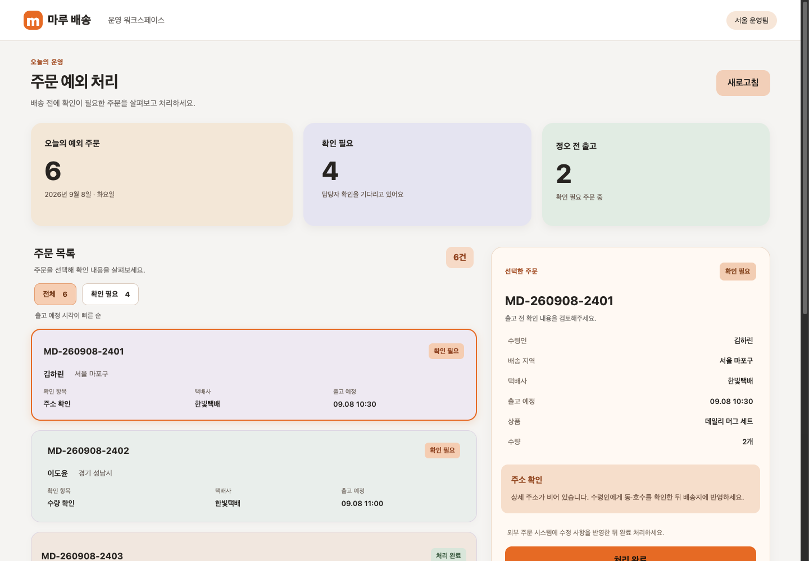
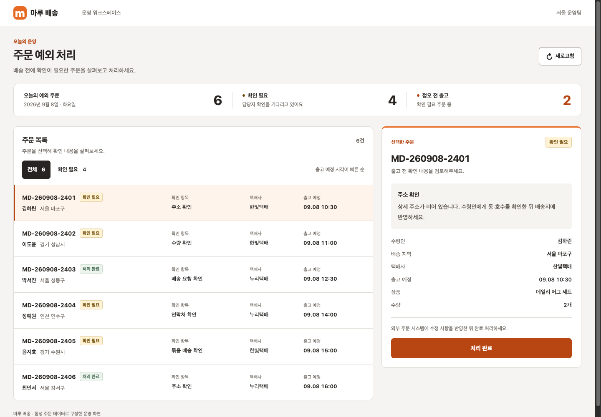
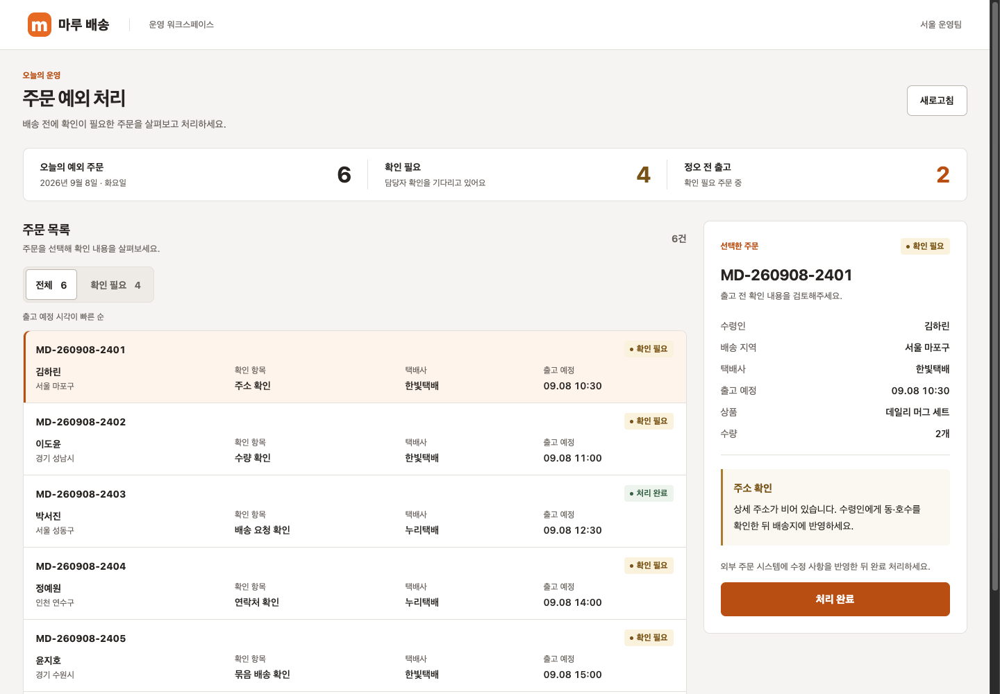
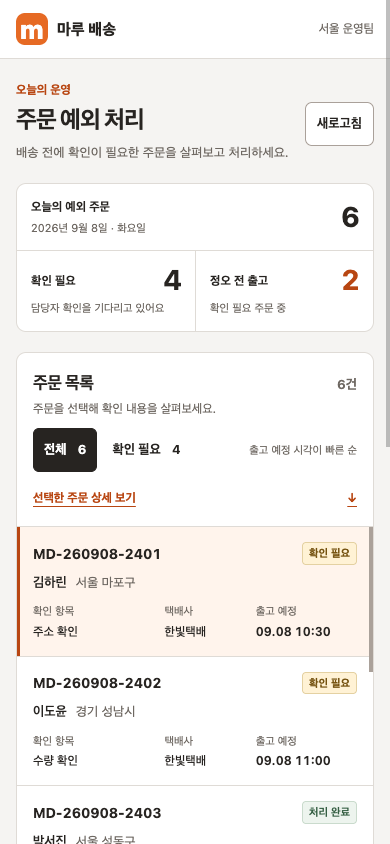
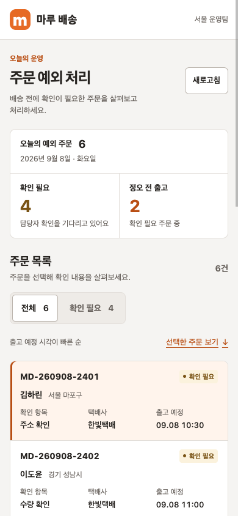

# 배색·배치 단일 비교 기록 · 2026-09-08

마루 배송 합성 화면을 같은 요청·원본·Chrome 조건으로 두 새 에이전트 문맥에서 한 번씩 수정했다. 기준은 `ecefe1da3bf956dea453e1670f89b488f2b38343`의 스킬, 후보는 이번 2.4.0에 포함된 스킬 snapshot이다. 두 구현 모두 허용된 HTML·CSS·디자인 기록만 바꾸고 `app.js`·기존 ID/data 속성·여섯 주문을 유지했다.

[집계](summary.json) · [시각 검수](review.md) · [원본 압축](evidence.tar.gz) · [파일 inventory](archive-inventory.json) · [해시](SHA256SUMS)

## 실행 조건과 결과

- 각각 `fork_turns=none`, `snapshot-direct`로 자체 스킬과 필요한 연결 참조를 읽었다. 모델·reasoning은 같은 부모 runtime을 상속했고 override는 없었다. 숨겨진 버전·sampling/seed는 제공되지 않았다.
- 사례·기능 시나리오·시각 항목·1440×1000 / 390×844 / 320×812 화면 조건을 실행 전에 `plan.json`에 기록했다. 두 스킬과 원본의 파일 해시도 `setup.json`에 고정했다.
- 부모 소유 수집기로 초기 집계, 필터·선택, 저장 실패, 완료·새로고침·재접속 저장, 완료 후 필터, 클릭 접근·Tab 순회·페이지 가로 넘침·런타임 예외를 같은 순서로 확인했다. 실제 Chrome CDP 입력을 사용했고 각 폭은 새 프로필에서 시작했다.
- 원본·기준·후보 각각 **54/54 검사 통과**다. 이 수에는 반복 클릭 접근 검사가 포함된다. 같은 동작 통과를 스킬 개선으로 세지 않는다. 소스 계약 검사 4개도 기준·후보 각각 통과했다.
- 구현 에이전트 자체의 61개/27개 검사 수는 서로 검사 구성이 달라 비교 점수로 사용하지 않았다. 원래 스크립트·명령·보고·이미지를 별도로 보존했다.

실행 환경은 macOS 26.6.2 arm64, Node 26.8.1, Python 3.9.6, Chrome 152.0.7977.76이다. 독립 AI 시각 검수에는 버전 매핑·스킬·구현자의 자기 평가를 제공하지 않고 중립 이름의 제품과 같은 조건의 이미지를 제공했다. 사람의 선호 조사나 사용자 성과 측정이 아니다.

## 시각 비교 결과

중립 이름 X는 후보, Y는 기준이었다. 브랜드·배색 역할·비교는 동률, 작업 위계와 그룹 정렬은 기준 우위, 좁은 화면 접근은 후보 소폭 우위로 판정했다. 기준은 넓은 화면의 여섯 행과 문제 중심 상세가 강점이지만 모바일 내부 스크롤과 작은 글자를 사용했다. 후보는 더 큰 글자와 단일 페이지 목록·상단 복귀 링크가 강점이지만 목록이 길어졌다.

두 결과는 원본보다 개요를 압축하고 반복 정렬을 안정시켰다. **이번 한 쌍에서 후보의 전반적인 우월성은 입증하지 못했다.** 성공·실패 알림의 공통 외형과 각 구성의 제약도 원본 검수에 남겼다. 지침 확장과 실제 관찰 범위를 구분한다.

## 같은 초기 상태의 화면

원본 1440×1000:



| 기준 1440×1000 | 후보 1440×1000 |
| --- | --- |
|  |  |

| 기준 390×844 | 후보 390×844 |
| --- | --- |
|  |  |

## 수집기 정정

초기 수집기는 Tab을 12번까지만 순회해 후보의 좁은 화면 두 곳에서 완료 버튼 도달 검사를 실패로 기록했다. 새 문서 내 이동 링크 두 개가 유효한 포커스 정지점을 추가한 것이 원인이었다. 사전 계획에 12회 제한은 없으며 실제 조작 접근 여부를 요구한다.

정정 전 수집기·설정·결과를 `collection-before-tab-bound/`에 보존했다. 유한 순회 상한을 DOM의 조작 요소 수에 따라 정하도록 고치고 원본·기준·후보를 같은 최종 수집기로 확인했다. 최종 원본·후보 재수집과 기준 수집 모두 54/54다. 제품이나 스킬을 이 정정으로 바꾸거나 에이전트를 다시 실행하지 않았다.

## 보존 자료와 재확인

압축의 `color-layout-v1/`에는 원본 제품, 두 스킬 snapshot, 요청·사전 계획·설정, 제품 diff와 최종 제품, 구현자 증거, 부모 수집기·관찰 JSON·이미지, 시각 검수와 중립 이름 매핑을 포함한다. 시각 검수의 `version-x`/`version-y` 이미지는 `review-map.json`을 통해 `observed/lane-a`/`observed/lane-b`의 동일 파일에 대응한다. 중립 경로는 압축 내부의 하드링크로 유지하며, 원본 재수집과 바이트가 달랐던 이미지 한 장은 검수자가 읽은 복사본도 별도로 보존한다. `review-image-aliases.json`에 대조 결과가 있다.

```sh
(cd evals/records/2026-09-08-color-layout-v1 && shasum -a 256 -c SHA256SUMS)
color_trial="$(mktemp -d)"
tar -xzf evals/records/2026-09-08-color-layout-v1/evidence.tar.gz -C "$color_trial"
python3 "$color_trial/color-layout-v1/check_source.py"
node "$color_trial/color-layout-v1/collect.mjs" original
node "$color_trial/color-layout-v1/collect.mjs" lane-a
node "$color_trial/color-layout-v1/collect.mjs" lane-b
```

수집 재실행에는 Node 22 이상과 기존 Chrome이 필요하며 새 결과를 압축 해제한 `observed/`에 쓴다. 모델을 다시 실행하는 명령이 아니다. 구현자가 남긴 과거 절대 경로 명령은 당시 작업 기록이다. 전체 도구 transcript는 제공되지 않았고 누락 기록을 재구성하지 않았다. 파일 해시는 관찰의 진실성이나 전체 실행 격리를 인증하지 않는다.

단일 제품·한 쌍의 결과다. 반복·전이 사례, 설치된 호스트의 발견/호출, 실기기·스크린리더·다른 브라우저 검증은 하지 않았다. 정적 사례 계약 24개나 패키지 회귀 검사는 이 실행 횟수에 포함하지 않는다. 이 기록은 source 전용이며 npm·오프라인 스킬 payload에는 포함하지 않는다.
